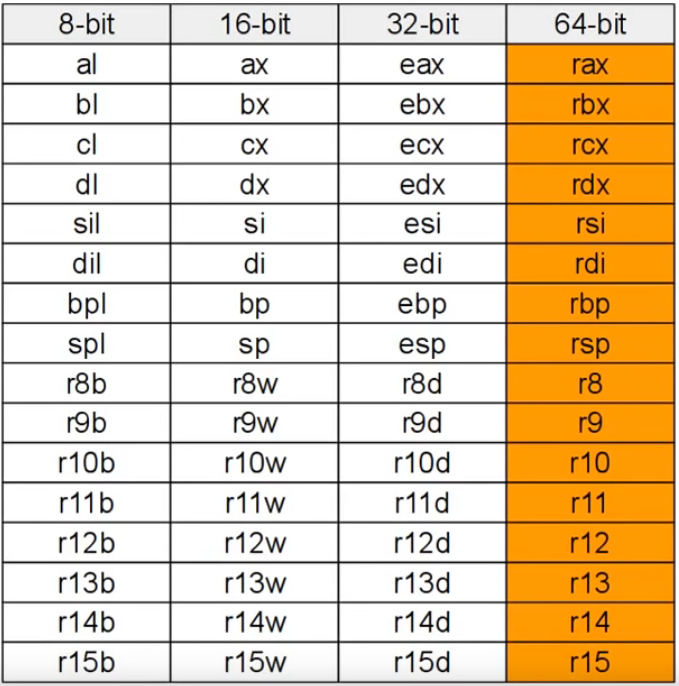

# Linux x86_64 Assembly

## Commands

- `nasm -f elf64 -o hello.o hello.asm`
- `ld hello.o -o hello`

## Registers

Source: [x86_64 Linux Assembly #2 - "Hello, World!" Breakdown](https://www.youtube.com/watch?v=BWRR3Hecjao&list=PLetF-YjXm-sCH6FrTz4AQhfH6INDQvQSn&index=2)

Usually where registers are used, pointers can also be used.
Like instead of `pop reg` `pop [label]` to pop a value off the stack directily into memory.

## System Call Inputs by Registers

| Argument | Registers |
| :------- | :-------- |
| ID       | rax       |
| 1        | rdi       |
| 2        | rsi       |
| 3        | rdx       |
| 4        | r10       |
| 5        | r8        |
| 6        | r9        |

## System Calls

Can be found [here](https://blog.rchapman.org/posts/Linux_System_Call_Table_for_x86_64/)

| rax | System Call | rdi                              | rsi        | rdx          | r10 | r8  | r9  |
| :-- | :---------- | :------------------------------- | :--------- | :----------- | :-- | :-- | :-- |
| 0   | sys_read    | unsigned int fd (filedescriptor) | char\* buf | size_t count |     |     |     |
| 1   | sys_write   | unsigned int fd                  | char\* buf | size_t count |     |     |     |
| 60  | sys_exit    | int error_code                   |            |              |     |     |     |

## Conditional Jump

unsigned version in parentheses

| Jump Symbol | Result of cmp a,b / Condition |
| :---------- | :---------------------------- |
| je          | `a=b`                         |
| jne         | `a!=b`                        |
| jg (ja)     | `a>b`                         |
| jge (jae)   | `a>=b`                        |
| jl (jb)     | `a<b`                         |
| jle (jbe)   | `a<=b`                        |
| jz          | `a=0`                         |
| jnz         | `a!=0`                        |
| jo          | overflow occurred             |
| jno         | overflow didn't occur         |
| js          | is signed                     |
| jns         | not signed                    |

## Math Operations

unsigned version in parentheses

| Name               | Description     |
| :----------------- | :-------------- |
| add a, b           | `a = a+b`       |
| sub a, b           | `a = a-b`       |
| mul reg (imul reg) | `rax = rax*reg` |
| div reg (idiv reg) | `rax = raw/reg` |
| neg reg            | `reg = -reg`    |
| inc reg            | `reg = reg+1`   |
| dec reg            | `reg = reg-1`   |
| adc a, b           | `a = a+b+CF`    |
| sbb a, b           | `a = a-b-CF`    |
